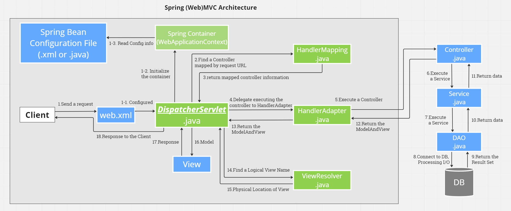

# ✅ Spring (Web) MVC 아키텍처 심층 분석



---

## ✅ 1. 아키텍처 핵심 요약

이 구조는 **전통적인 Spring MVC (XML 기반)** 방식으로,

| 구성 요소         | 역할                                           |
| ----------------- | ---------------------------------------------- |
| `web.xml`         | DispatcherServlet 등록, 스프링 컨텍스트 초기화 |
| RootContext       | Service, Repository 빈 설정                    |
| ServletContext    | Controller, ViewResolver 빈 설정               |
| DispatcherServlet | 모든 HTTP 요청의 중앙 처리                     |
| HandlerMapping    | URL → Controller 매핑                          |
| HandlerAdapter    | Controller 실행 담당                           |
| Controller        | 비즈니스 로직 호출, ModelAndView 반환          |
| Service → DAO     | DB 연동 및 데이터 가공                         |
| ViewResolver      | View 이름을 실제 JSP 파일로 매핑               |
| View              | 최종 화면 렌더링                               |

---

## ✅ 2. 실행 흐름 (단계별 상세 분석)

---

### 📌 ① 클라이언트 요청

```plaintext
GET /hello
```

### 📌 ② web.xml

```xml
<servlet>
  <servlet-name>appServlet</servlet-name>
  <servlet-class>org.springframework.web.servlet.DispatcherServlet</servlet-class>
  ...
</servlet>
```

- 톰캣이 기동하면서 `DispatcherServlet`을 서블릿으로 등록
- `CharacterEncodingFilter`로 UTF-8 강제 인코딩 적용

---

### 📌 ③ DispatcherServlet 초기화

- `WEB-INF/spring/appServlet/servlet-context.xml` 로드
- `@Controller`, `@RequestMapping` 활성화 (`<annotation-driven />`)

---

### 📌 ④ 요청 처리 플로우

#### ❶ DispatcherServlet

```plaintext
1. 요청 수신 → HandlerMapping 조회
```

#### ❷ HandlerMapping

```plaintext
"/hello" → HelloController의 sayHello() 매핑
```

#### ❸ HandlerAdapter

```plaintext
HelloController의 메서드 실행
```

#### ❹ HelloController

```java
@GetMapping("/hello")
public ModelAndView sayHello() {
    String result = helloService.getHelloMessage();
    ModelAndView mav = new ModelAndView();
    mav.addObject("message", result);
    mav.setViewName("list");
    return mav;
}
```

- Service → DAO → DB에서 데이터 조회
- ModelAndView에 데이터와 뷰 이름을 설정해 반환

---

### 📌 ⑤ ViewResolver

```xml
<bean class="org.springframework.web.servlet.view.InternalResourceViewResolver">
  <property name="prefix" value="/WEB-INF/views/" />
  <property name="suffix" value=".jsp" />
</bean>
```

- "list" → "/WEB-INF/views/list.jsp"

---

### 📌 ⑥ View 렌더링

- JSP에서 `${message}` 출력
- UTF-8로 인코딩된 HTML 결과를 클라이언트에 반환

---

## ✅ 3. Spring 컨테이너와 서블릿 컨테이너의 관계

| 구분                                        | 내용                                              |
| ------------------------------------------- | ------------------------------------------------- |
| **서블릿 컨테이너 (톰캣)**                  | web.xml 기반, DispatcherServlet을 서블릿으로 등록 |
| **Spring 컨테이너 (WebApplicationContext)** | DispatcherServlet에 종속, 빈 관리                 |
| **Root Context**                            | 전역 빈 (Service, DAO 등) 관리                    |
| **Servlet Context**                         | 웹 관련 빈 (Controller, ViewResolver 등) 관리     |
| **ContextLoaderListener**                   | RootContext를 기동 시 초기화                      |
| **DispatcherServlet**                       | 요청을 받아서 ServletContext 기반으로 처리        |

---

## ✅ 4. JUL, Log4j2, 로그 형식 일치화

- **톰캣 JUL 기본 로그**

  ```plaintext
  3월 07, 2025 오전 11:55:24 org.apache.catalina.core.ApplicationContext log
  INFO: Initializing Spring DispatcherServlet 'appServlet'
  ```

- **Log4j2 애플리케이션 로그 (형식 커스텀)**
  ```xml
  <PatternLayout charset="UTF-8"
    pattern="%d{yyyy-MM-dd a hh:mm:ss} %c.%M%n%-5level: %msg%n"/>
  ```
  →
  ```
  2025-03-07 오전 11:55:24 dev.mvc.spring.HomeController.home
  INFO : 방가방가 Welcome home! The client locale is ko_KR.
  ```

✅ JUL → Log4j2로 리다이렉트했으니  
톰캣의 내부 로그도 Log4j2 포맷과 최대한 유사하게 맞출 수 있음.

---

## ✅ 5. CharacterEncodingFilter로 인코딩 통일

```xml
<filter>
  <filter-name>encodingFilter</filter-name>
  <filter-class>org.springframework.web.filter.CharacterEncodingFilter</filter-class>
  <init-param>
    <param-name>encoding</param-name>
    <param-value>UTF-8</param-value>
  </init-param>
  <init-param>
    <param-name>forceEncoding</param-name>
    <param-value>true</param-value>
  </init-param>
</filter>
```

- 클라이언트 → 서버 → DB → 뷰까지 **UTF-8 통일**
- JSP 내부 `<%@ page contentType="text/html; charset=UTF-8" %>`도 반드시 확인

---

## ✅ 6. 참고용 플로우 정리 (이미지 보충)

```plaintext
[Client]
  ↓
[TOMCAT (서블릿 컨테이너)]
  ↓ web.xml
[ContextLoaderListener] → RootContext (Service, DAO)
  ↓
[DispatcherServlet] → ServletContext (Controller)
  ↓
[HandlerMapping → HandlerAdapter → Controller]
  ↓
[Service → DAO → DB]
  ↓
[ModelAndView]
  ↓
[ViewResolver]
  ↓
[View(JSP)]
  ↓
[Client 응답]
```
